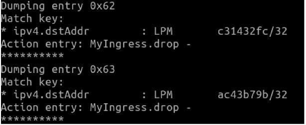

# Usom IP Blocker using P4

### What is P4? [WikiPedia](https://en.wikipedia.org/wiki/P4_(programming_language))
> P4 is a programming language for controlling packet forwarding planes in networking devices, such as routers and switches. In contrast to a general purpose language such as C or Python, P4 is a domain-specific language with a number of constructs optimized for network data forwarding. P4 is distributed as open-source, permissively licensed code, and is maintained by the P4 Language Consortium, a not-for-profit organization hosted by the Open Networking Foundation. 

### The Aim of Project
The aim of Usom IP Blocker project prevents all packets that request from host to blocked urls in topology which pictured below. 

### Topology Structure


## Start Setup

In order to create the topology and simulate it on mininet, the virtual machine with p4 ready installed should be downloaded as ova image and run on VirtualBox.

VMBox .ova image download [here](https://drive.google.com/file/d/1ZkE5ynJrASMC54h0aqDwaCOA0I4i48AC/view)

* ``` python3 UsomUrlHelper.py ``` - create blocked_url.json file
* Copy s1-runtime.json file from **/home/p4/tutorials/exercies/basic/pod-topo** in VMBox to local directory
* ``` python3 P4SwitchJsonCreator.py ``` - append drop rules to s1-runtime.json file
* Copy s1-runtime.json from local directory to **/home/p4/tutorials/exercies/basic/pod-topo** in VMBox
* ``` cd /home/p4/tutorials/exercises/basic ``` on VMBox
* ``` make clean ``` on VMBox
* ``` make run ``` on VMBox

## See Drop Rules on S1 Switch Table Rules
* ``` simple_switch_CLI --thrift-port 9090 ``` on VMBox
* ``` table_dump MyIngress.ipv4_lpm ``` on VMBox



IP addresses evolve in hexadecimal format. ac43b79b decimal corresponds to ip 172.67.183.155
